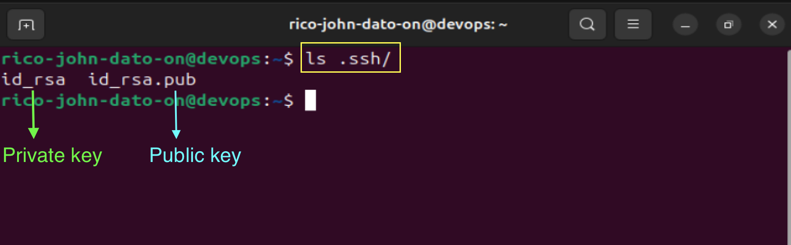

# 🔐 SSH (Secure Shell)

This repository contains summarized notes and usage examples of **SSH (Secure Shell)**. SSH is a secure protocol that allows users to access and control remote servers.

---

## 📘 What is SSH?

**SSH (Secure Shell)** is a cryptographic network protocol for operating network services securely over an unsecured network.

Use cases:

- Securely connect to remote servers
- Transfer files using `scp` or `sftp`
- Execute remote commands or scripts
- Administer cloud or physical infrastructure

---

## 🔑 SSH Authentication Methods

### 1. **Username & Password**

- Traditional way to authenticate.
- Used when a user is created on the remote server.
- Less secure and requires manual input.

### 2. **SSH Key Pairs (Public/Private)**

- Recommended authentication method.
- **Private Key** stays on the client machine (e.g id_rsa).
- **Public Key** is copied to the remote server under `~/.ssh/authorized_keys` (e.g id_rsa_pub).
- More secure and supports automation.

---

## ⚙️ How SSH Works

1. Client runs: `ssh user@remote_ip`
2. Server listens on **port 22** by default.
3. If connection is allowed by firewall:
   - The server authenticates the client (via password or key).
   - SSH session is established.
4. You can now control the remote machine’s CLI.

---

## 🔐 Generating SSH Keys

```bash
# Generate SSH key pair using RSA
ssh-keygen -t rsa

# Default location: ~/.ssh/id_rsa (private), ~/.ssh/id_rsa.pub (public)
```


```bash
# Check .ssh folder
ls. ssh
```



---

## 📁 Setting Up SSH Access on Remote Server

### Add your public key to the remote server:


```bash
# On your linux machine
cat .ssh/id_rsa.pub

# copy your public key
```

```bash
# On the remote server
mkdir -p ~/.ssh
vim ~/.ssh/authorized_keys

# Paste your public key
```

---

## 🔗 Connecting via SSH

```bash
# Standard connection
ssh rico@remote_ip

# To connect make sure you enable remote login or allow SSH to your fire wall
```

---


## 📂 Copying Files via SCP


### Create a simple script and copy to remote server

```bash
vim greet.sh
echo "Hello World"

# Save and exit
```

# on terminal

```bash
# Make script executable
chmod a+x greet.sh

# Execute it
./greet.sh

scp greet.sh rico@192.168.2.234:~/

# this will copy the file "greet.sh" to remote server user rico's home directory
```

---

## 🧱 Firewall Considerations

- Port **22** must be open on the server.
- Restrict access to specific IP addresses when possible.
- Use cloud platform firewalls or `ufw`/`iptables`.

## 💡 Summary

- SSH is essential for DevOps work and remote server management.
- SSH key pairs are secure and automate authentication.
- SCP allows secure file transfers.
- SSH is a foundational skill for deploying, managing, and automating infrastructure.

🧑‍💻 _Created by Rico John Dato-on_
🔗 [LinkedIn](https://www.linkedin.com/in/rico-john-dato-on) • [Portfolio](https://ricodatoon.netlify.app)
